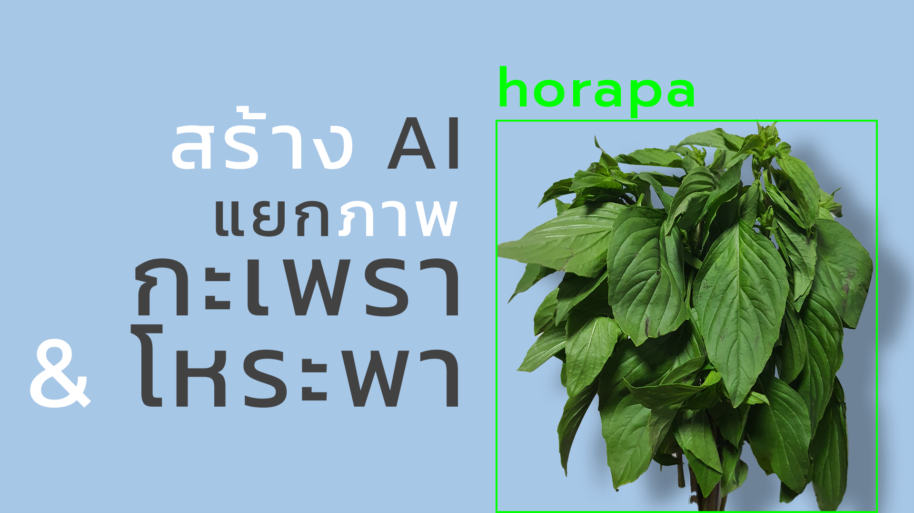
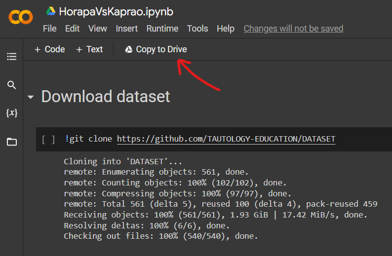
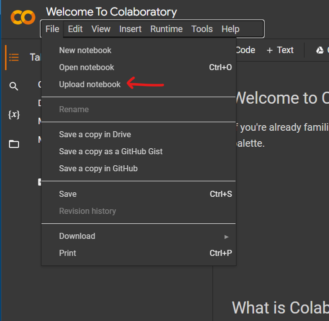
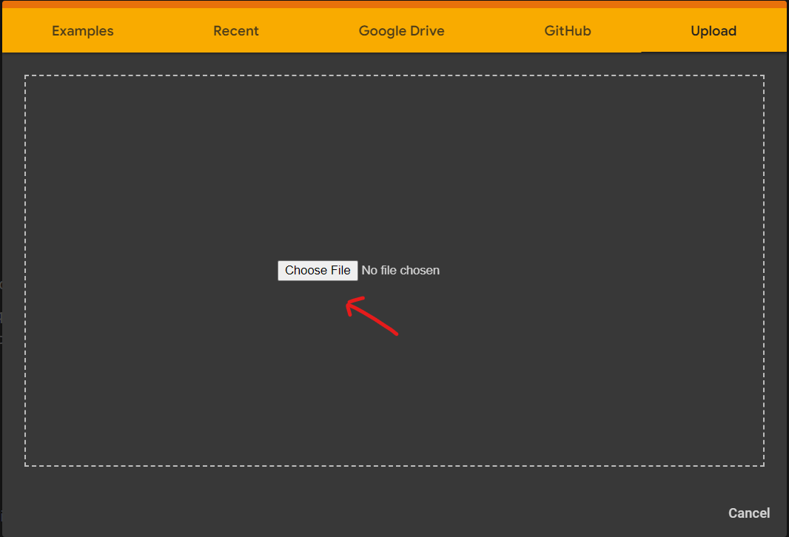
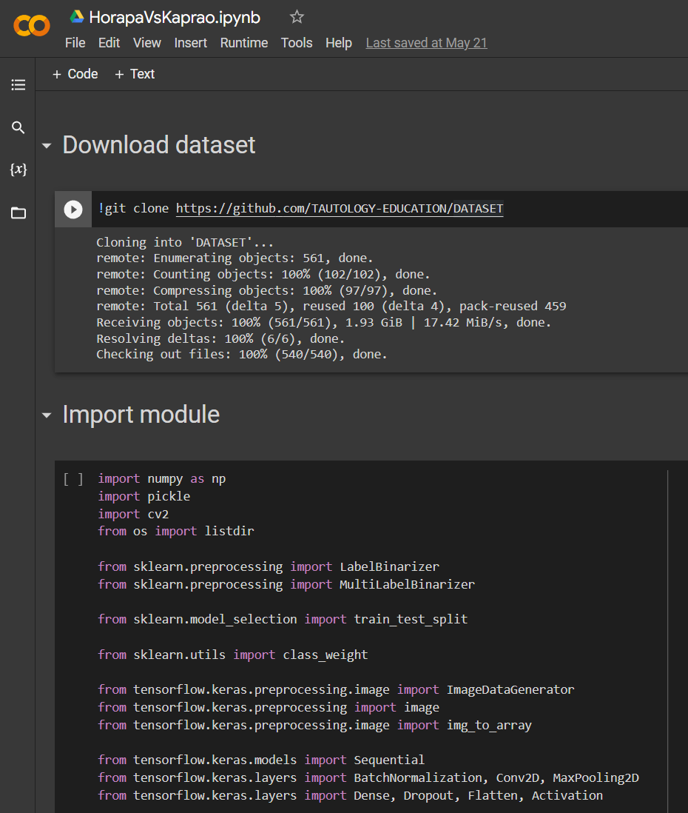
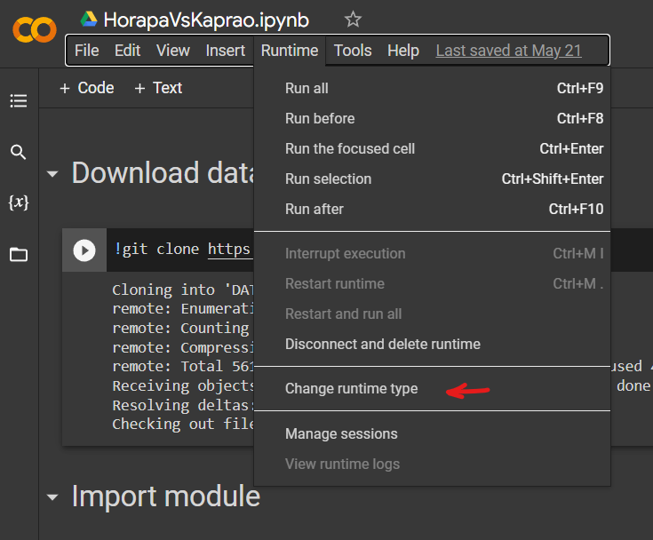
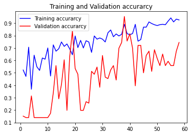
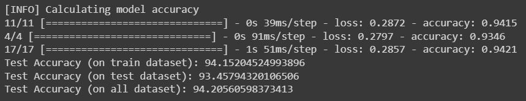
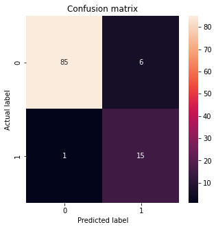

## About Horapa Vs Kaprao

_HorapaVsKaprao_ - a project for training an AI to classified the pictures of 2 types of plants, **Thai basil (Horapa)** and **Holy basil (Kaprao)**

In this project, I created an AI without pretrained model to classified two types of plants **Thai basil (Horapa)** and **Holy basil (Kaprao)**, but there are some problems with the dataset i.e. imbalance of the dataset and lack of data. I need to solve those problems to get the best model.

## Dataset

Thank you [dataset](https://github.com/TAUTOLOGY-EDUCATION/DATASET/tree/main/HorapaVsKaprao) from [Tautology Thailand](https://www.facebook.com/tautologyai/photos/a.1958623857592839/4882385715216624/)

## Youtube

For more information can be seen in my [video](https://youtu.be/kdaR6t4QL2E) on YouTube.

## Requirements

- Google Colab

## Install

- Copy from my [colab project](https://colab.research.google.com/drive/1sRddhORHB8w6DY7NP9WXBGuihFgxl_Oa?usp=sharing)
  

- Download from [this repository](https://github.com/TitorPs360/horapa-vs-kaprao/blob/main/HorapaVsKaprao.ipynb) and import to colab
  

  

## Usage

1. Open this project in Google Colab

   

2. Change runtime type to **GPU**

   
   

3. Run all cell

## Training Result

- Training history graph

  

- Accuracy on test dataset

  

- Confusion matrix

  
